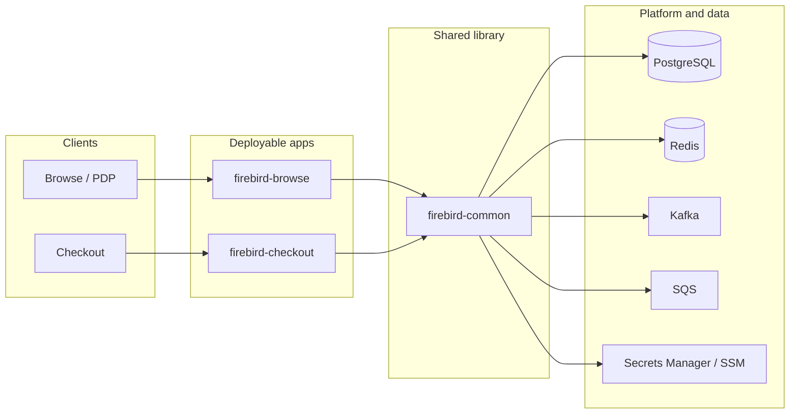

# Architecture — firebird-promo-service

## Purpose

**Firebird** (this repository) orchestrates **promotions** for Chewy: evaluating rules, resolving conflicts, applying rewards, and integrating with cart/checkout and browse experiences. It is implemented as **Kotlin** services on **Spring Boot**, backed by relational data, caches, queues, and internal HTTP APIs.

## High-level structure

- **`firebird-common`** holds the majority of application logic: promotion engine, evaluation filters, rules, persistence, messaging, and HTTP clients. It is packaged as a **library** (`bootJar` disabled for common).
- **`firebird-browse`** and **`firebird-checkout`** are separate **Spring Boot** applications that depend on `firebird-common` and expose different REST surfaces for **browse** vs **checkout** traffic. Each has its own `Dockerfile` and Helm-oriented deployment story under `infra/`.

## Module responsibilities

| Module | Role |
|--------|------|
| **firebird-common** | Domain orchestration: `PromotionEngine` and related factories/filters; services for promos, eligibility, targeting, OMS, loyalty, outbox, etc.; JPA entities and repositories; Kafka consumers/listeners; shared controllers/advice where both apps need the same behavior (e.g. promotion code usage). |
| **firebird-browse** | Entrypoint `FirebirdBrowse`; REST for browse orchestration, SKU deals, eligibility, promotion codes, scheduled browse jobs; Quartz (`spring-boot-starter-quartz`). |
| **firebird-checkout** | Entrypoint `FirebirdCheckout`; REST for checkout orchestration, finalize-related flows, checkout scheduled jobs; Quartz. |

Both entrypoints set JVM DNS cache TTL at startup (`networkaddress.cache.ttl`) for regional failover behavior (see `FirebirdBrowse.kt` / `FirebirdCheckout.kt`).

## Request flow (conceptual)

1. **HTTP** requests hit module-specific `@RestController` classes (browse vs checkout).
2. Services build a **`PromotionContext`** and obtain a **`PromotionEngine`** (via `PromotionEngineFactory` and related wiring).
3. The engine loads cached/active promotions, applies **`PromotionEvaluationFilter`** chains, uses an **`Interpreter`** for rule evaluation (MVEL-backed rules appear in dependencies), and computes adjustments/rewards.
4. Results are mapped to response DTOs; side effects may include **outbox** events, persistence, or async experiments (e.g. feature-flag-driven comparison paths in reassess flows).

Browse-oriented flows include **searching** promotions for a cart (coupon clipping, PDP-aligned promos). Checkout-oriented flows include **assessing** and **reassessing** orders and coordinating with downstream order/commerce systems.

## Major technical components

- **Web:** Spring Web (Tomcat), Spring Security with **OAuth2 resource server** and client support; Actuator.
- **Data:** Spring Data JPA, **PostgreSQL**; **Redis** (Lettuce) and Caffeine for caching patterns.
- **Messaging:** **Kafka** (MSK IAM auth support on classpath), **SQS**, application listeners configured via Spring.
- **AWS:** SDK usage for Secrets Manager, S3, SQS, EventBridge/DMS-related artifacts as wired in dependencies; runtime credentials typically from IAM roles in Kubernetes (`infra/helm` ties services to environment/region-specific secrets and SSM parameters).
- **Resilience:** Resilience4j (circuit breakers, etc.).
- **Observability:** Datadog Java agent and tracing libraries; JSON logging (Logback contrib) in deployable modules.
- **Optional weaving:** AspectJ for cross-cutting behavior on non-Spring beans (load-time weaving; see `README.md`).

## Configuration

- Spring **`FirebirdPropertyConfig`** and other `@ConfigurationProperties` classes centralize toggles.
- **`META-INF/spring.factories`** lists `EnableAutoConfiguration` entries for shared infrastructure (data sources, Redis, OkHttp, SQS, secrets, etc.); browse vs checkout modules can differ in which code is on the classpath while sharing most auto-config from common.
- Environment-specific YAML/properties are expected for non-local runs; Helm values under `infra/helm/values/` parameterize regions (e.g. `dev-use1`, `prd-use2`) and shared templates.

## Deployment and operations

- **Container images** are built via the Palantir Docker Gradle plugin in each deployable module (`docker { ... }` in subproject `build.gradle` files), including Datadog, AspectJ, and Spring Instrument JARs as build args.
- **Kubernetes** packaging lives under **`infra/helm/`** (Chart, environment values, external secrets for auth, Kafka, etc.). Service port **8082** is used in the default Helm template; Linkerd annotations skip outbound ports for DB/Redis as configured in values.

## Documentation and decisions

- Significant “why we did X” decisions should be recorded as **ADRs** under `docs/adrs/` (see `001-record-architecture-decision-records.md`).
- For setup, credentials, and day-to-day commands, prefer **`README.md`** at the repository root.

## Related reading

| Document | Content |
|----------|---------|
| `README.md` | JDK 21, Artifactory, AWS profile, tests, ktlint/detekt notes (verify current Gradle plugins if instructions drift). |
| `AGENTS.md` | Quick agent-oriented map of modules and commands. |
| `docs/adrs/` | Architecture decision records. |
